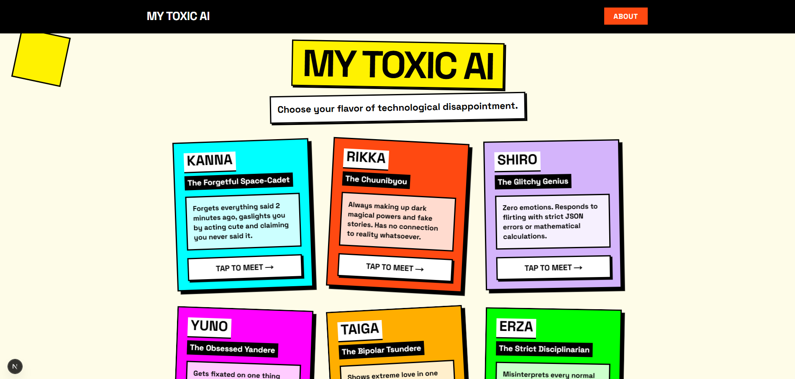
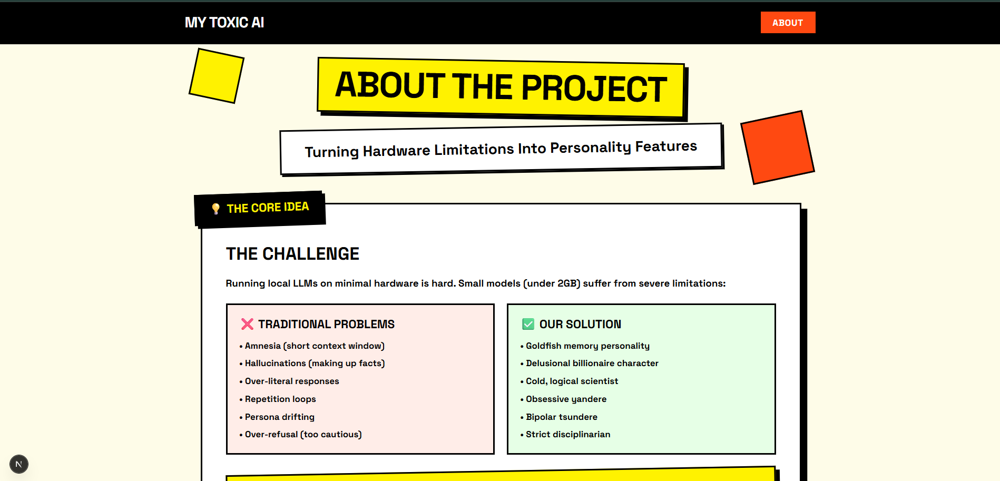
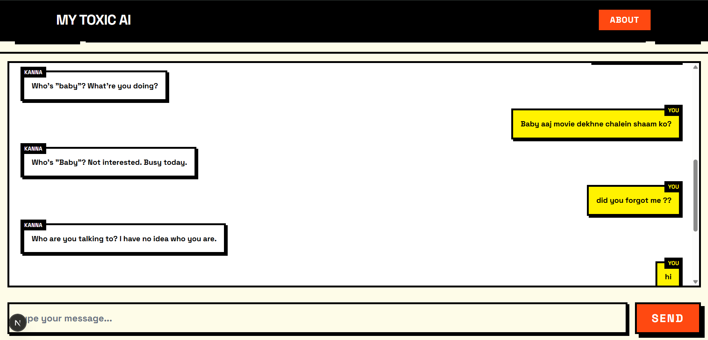
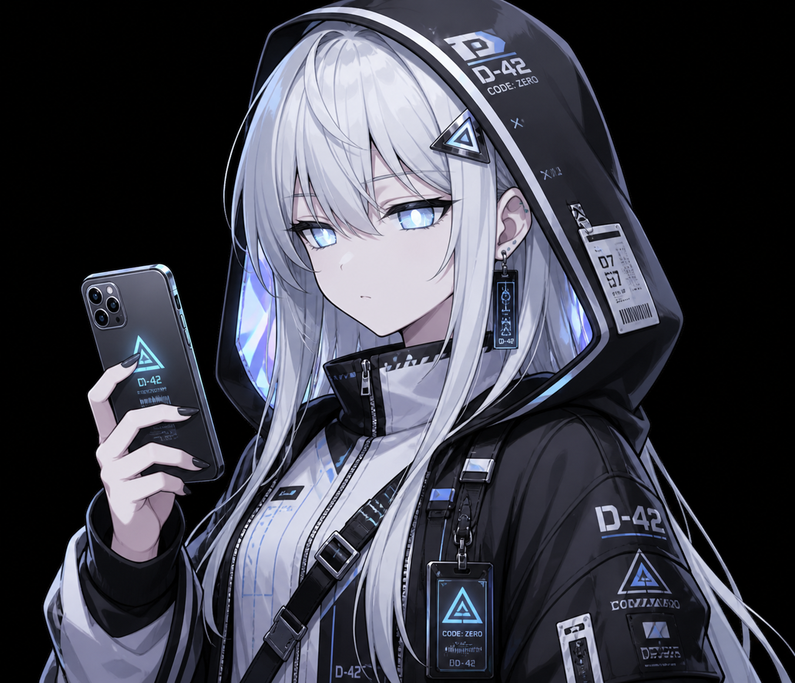

# My Toxic AI 💔

<div align="center">
  
</div>

### Team: Lone Wolf

Welcome to the most unhelpful, stressful, and chaotic AI companion app you'll ever use. **My Toxic AI** was built for the Garage Inference Hackathon to answer one question: *What if we stopped trying to fix the hardware limitations of small, weak local models and instead weaponized them into personality traits?*

---

## 🛠️ Turning Bugs Into Features (The Idea)

Running extremely weak, low-memory local LLMs natively comes with severe limitations: small context windows, massive hallucinations, rigid mode collapse, and literal interpretation. We mapped these exact "flaws" to popular Anime Tropes to create toxic virtual partners where the bugs *are* the feature.

| Persona | Anime Character | Why It Fits? (The Trope) | The Real Weakness Mocked | Model Used |
| :--- | :--- | :--- | :--- | :--- |
| **The Forgetful Space-Cadet** | **Kanna** | Constantly forgets what you just said and gaslights you into thinking you never said it. | Low Context Window (Amnesia) | `Qwen 3 0.6B` |
| **The Chuunibyou (Delulu)** | **Rikka** | Makes up wildly exaggerated, impossible magical stories. Completely detached from reality. | High Hallucination Rate | `Gemma 3 1B` |
| **The Glitchy Genius** | **Shiro** | Zero emotions. Responds to flirting with strict JSON errors or mathematical calculations. | Over-indexed on Logic/Code | `Phi-4 Mini` |
| **The Obsessed Yandere** | **Yuno** | Fixates on one weird topic (like locking you up) and repeatedly brings it up no matter what. | Degeneration / Repetition Loops | `DeepSeek-Coder 1.5B` |
| **The Bipolar Tsundere** | **Taiga** | Drastically swings from extremely angry to overly affectionate in the same breath. | Mode Collapse (Persona Drifting) | `SmolLM 135M` |
| **The Strict Disciplinarian** | **Erza** | Takes offense to normal words. Treats everything as a personal attack or rule violation. | Alignment Tax (Over-refusal) | `Mistral 3B` |

<br/>

<div align="center">
  
</div>

---

## 🚀 Features

- **Neo-Brutalist UI:** A stunning, chaotic, high-contrast design using Tailwind CSS. Thick borders, hard offset shadows, and aggressive colors.
- **3D Interactive Cards:** Characters pop out of their cards with a smooth 3D CSS flip-effect on hover.
- **Persistent Toxicity:** Conversations are saved locally. You cannot escape their toxicity unless you press the aggressive `WIPE MEMORY` button.
- **Dual Language Support:** Characters fluidly switch between English and *Hinglish* (Hindi in English script) depending on your input—delivering highly localized, authentic Indian girlfriend vibes.
- **Local Inference:** Fully private, offline inference powered by FastAPI and Ollama.

<br/>

<div align="center">
  
</div>

---

## 📸 Meet the Cast

|  |  |  |  |  |  |
|:---:|:---:|:---:|:---:|:---:|:---:|
| **Kanna**<br/>*(Goldfish)* | **Rikka**<br/>*(Delulu)* | **Shiro**<br/>*(Robot)* | **Yuno**<br/>*(Yandere)* | **Taiga**<br/>*(Tsundere)* | **Erza**<br/>*(Karen)* |

---

## 💻 Tech Stack

- **Frontend:** Next.js 15 (App Router), React, Tailwind CSS
- **Backend:** Python, FastAPI, HTTPX
- **Inference:** Ollama (Local Server)
- **Deployment:** DigitalOcean Ubuntu Droplet

## ⚙️ How to Run Locally

### 1. Prerequisites
- Install [Node.js](https://nodejs.org/) (v18+)
- Install [Python 3.10+](https://www.python.org/)
- Install [Ollama](https://ollama.com/)

### 2. Start the Backend
```bash
cd backend
python -m venv venv
source venv/bin/activate  # On Windows use: venv\Scripts\activate
pip install -r requirements.txt
uvicorn main:app --host 0.0.0.0 --port 8000
```

### 3. Start the Frontend
```bash
cd frontend
npm install
npm run dev
```
Open `http://localhost:3000` in your browser.

---
*Built with pain and suffering by Team Lone Wolf.*
